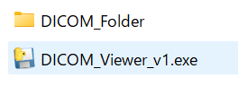
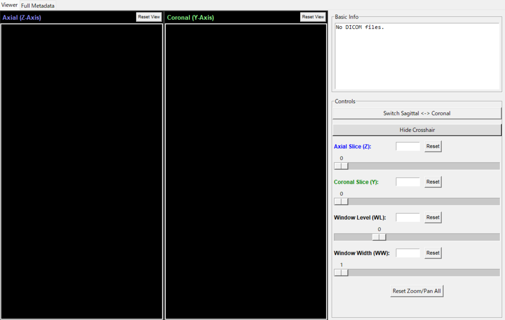
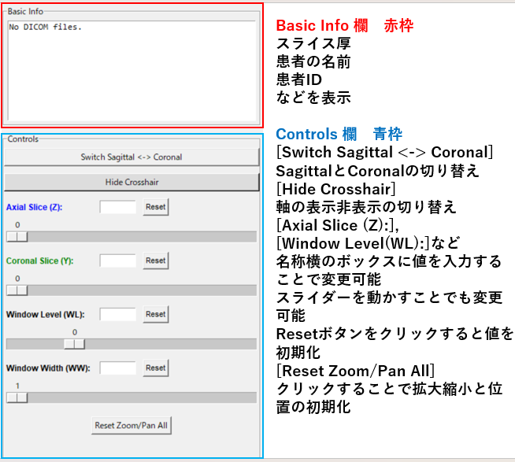

# DICOM_viewer
DICOMファイルのviewアプリです。

## 作成した環境
Visual Studio Code

## 実行環境
venvの仮想環境のセットアップ(Windowsを想定)
```
python -m venv .venv
.venv/Scripts/activate
```
依存関係のインストール
```
pip install -r requirements.txt
```

DICOMファイルの保存先
[DICOM_Folder]フォルダを[DICOM_Viewer_vX.exe]と同じ階層に作成し、その中に保存してください。 ※ vX の X はバージョン番号で読み替えてください。<br>


※.exeファイルが正常に動作しない場合(Download Zipでダウンロードした場合を想定)は
解凍したファイルの[viewr_main.py]と同じ階層に[DICOM_Folder]を作成し、その中に画像を保存した上で、
VScode上など、上記の仮想環境と依存関係を用意したうえで、下記を.venvの仮想環境上でターミナルから実行してください。
```
python viewr_main.py
```

## 内容説明
ダウンロードした[DICOM_Viwer_vX.exe]をダブルクリックして起動します。
同じ階層に用意した[DICOM_Folder]内のDICOMファイルを参照して画面に表示します。

アプリ画面

<br>
アプリ右側の説明


アプリ左側の説明
画面上で[ctrl]+[マウスホイールの回転]を使用することで、マウスポインタの位置を基準に拡大縮小の率を変更することができます。
画面上で左クリックを押しながら、マウスポインタを動かすことで、表示位置を動かすことができます。